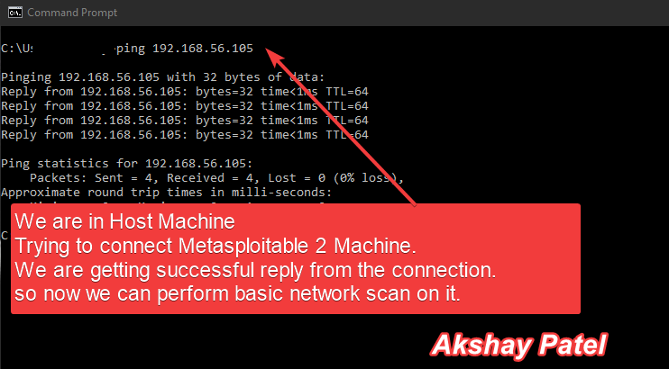
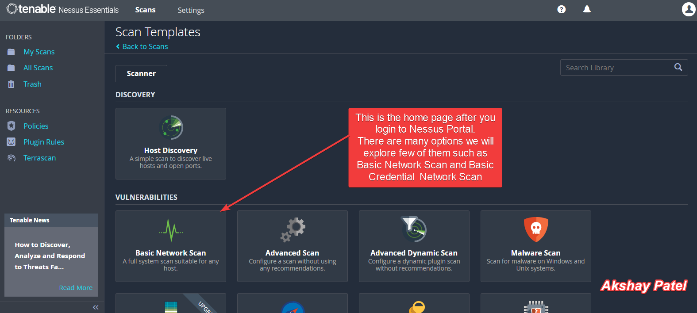
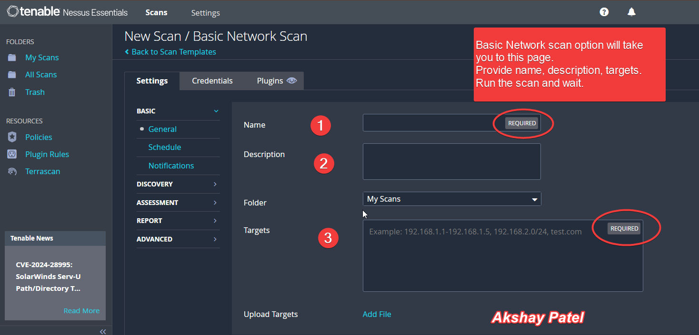
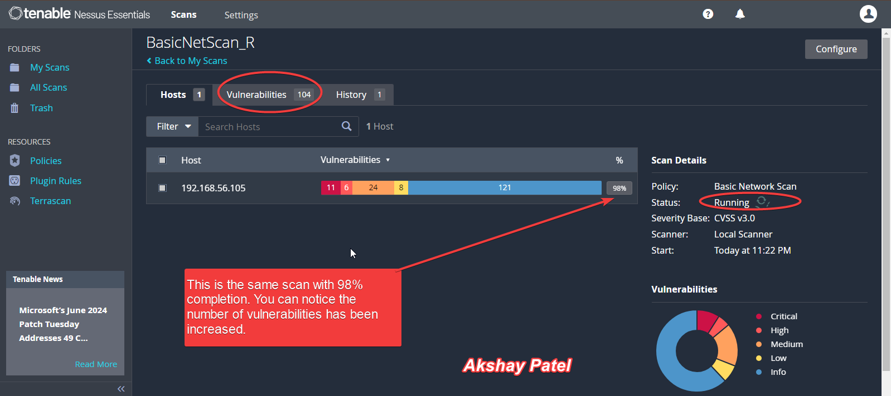
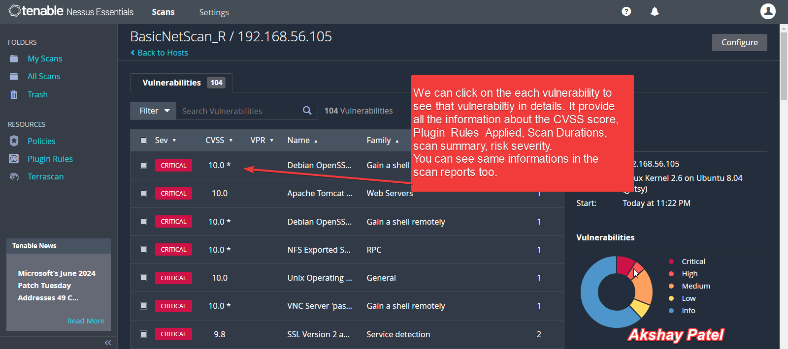
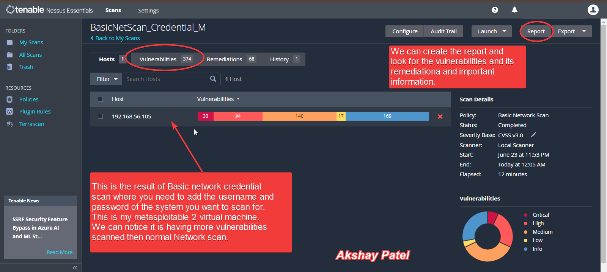
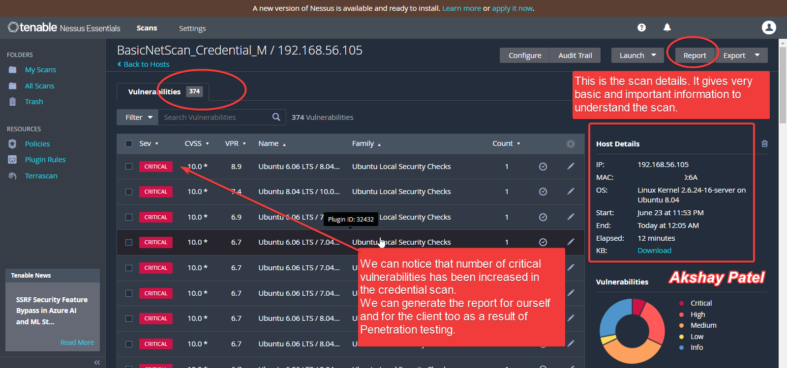

# Nessus Vulnerability Scanner Project

Welcome to the Nessus Vulnerability Scanner project. This project demonstrates how to perform basic network and credential scans using Nessus on a Metasploitable 2 virtual machine. The target audience includes cybersecurity students and employers looking to understand practical applications of vulnerability scanning.

## Project Overview

In this project, you will learn to:
1. Set up a Metasploitable 2 VM in VirtualBox.
2. Install and configure Nessus on your host machine.
3. Perform a basic network scan and a basic network credential scan.
4. Analyze the scan results.

## Prerequisites

- VirtualBox installed on your host machine.
- Nessus installed on your host machine.
- Metasploitable 2 VM image.

## Step-by-Step Instructions

### Step 1: Set Up Metasploitable 2 in VirtualBox

1. **Download Metasploitable 2**:
   - [Metasploitable 2 Download](https://sourceforge.net/projects/metasploitable/)

2. **Import Metasploitable 2 into VirtualBox**:
   - Open VirtualBox.
   - Go to `File > Import Appliance`.
   - Select the downloaded Metasploitable 2 .ova file.
   - Follow the prompts to import the VM.

3. **Configure Network Settings**:
   - Ensure the VM is configured to use a network adapter that allows communication with the host machine, such as Host-Only Adapter or NAT Network.

   **Screenshot: Metasploitable_VM_Network_Settings.png**

4. **Start the VM**:
   - Launch the Metasploitable 2 VM and log in with the default credentials (username: `msfadmin`, password: `msfadmin`). Use `ifconfig` command to check the IP address of the Metasploitable 2 machine. 

   

### Note: Go to one of my [Home Lab for Cybersecurity Project](https://github.com/AkshayPatel03/home-lab-for-cybersecurity) to learn how to develop secure virtaul environment to pratice, including installing Metasploitable 2, Windows 10. 

5. **Check connectivity**:
   - Open Command prompt in your host and ping the metasploitable 2 machine to check the connectivity.

   

### Step 2: Install and Configure Nessus

1. **Download Nessus**:
   - [Nessus Download](https://www.tenable.com/products/nessus)

2. **Install Nessus**:
   - Follow the installation instructions for your operating system.

3. **Configure Nessus**:
   - Open a web browser and navigate to `https://localhost:8834/`.
   - Complete the initial setup and create an admin account.
   - Obtain and apply the activation code. You will get it in your email. 

### Step 3: Perform a Basic Network Scan

1. **Create a New Scan**:
   - Log in to the Nessus web interface.
   - Go to `Scans > New Scan`.
   - Select `Basic Network Scan`.

    

2. **Configure Scan Settings**:
   - Name the scan (e.g., "Metasploitable Basic Network Scan").
   - Enter the target IP address of the Metasploitable VM.

    

    

   **Screenshot: Nessus_Basic_Network_Scan_Settings.png**

3. **Launch the Scan**:
   - Click `Save` and then `Launch` to start the scan.
   - Wait for the scan to complete.

    

    

    

    

### Step 4: Perform a Basic Network Credential Scan

1. **Create a New Scan**:
   - Go to `Scans > New Scan`.
   - Select `Basic Network Credential Scan`.
     
    

2. **Configure Scan Settings**:
   - Name the scan (e.g., "Metasploitable Credential Scan").
   - Enter the target IP address.
   - Provide valid credentials for the Metasploitable VM (username: `msfadmin`, password: `msfadmin`).
    
    

    

    

   **Screenshot: Nessus_Credential_Scan_Settings.png**

3. **Launch the Scan**:
   - Click `Save` and then `Launch`.

    

    

### Step 5: Analyze the Results

1. **View Scan Results**:
   - Navigate to `Scans > Completed` and select your scan.
   - Review the identified vulnerabilities.

    

    

2. **Document Findings**:
   - Take note of critical and high-severity vulnerabilities.
   - Understand the potential impact and remediation steps.

   

   

## Conclusion

This project provides a hands-on introduction to using Nessus for vulnerability scanning. By following these steps, you gain practical experience in setting up a vulnerable environment, performing scans, and analyzing results. We can perform same scans on the Windows 10 Virtual machines regular and credential scan before and after installing old vulnerable softwares such as old VLC or firefox. 

For further learning:
- [Nessus Documentation](https://docs.tenable.com/)
- [Metasploitable 2 Info](https://information.rapid7.com/metasploitable-download.html)

Feel free to explore more advanced features of Nessus and other vulnerability scanners to enhance your cybersecurity skills.

## Important Links

- [Metasploitable 2 Download](https://sourceforge.net/projects/metasploitable/)
- [Nessus Download](https://www.tenable.com/products/nessus)
- [Nessus Documentation](https://docs.tenable.com/)
- [Metasploitable 2 Info](https://information.rapid7.com/metasploitable-download.html)

Thank you for exploring this project. Happy scanning!
